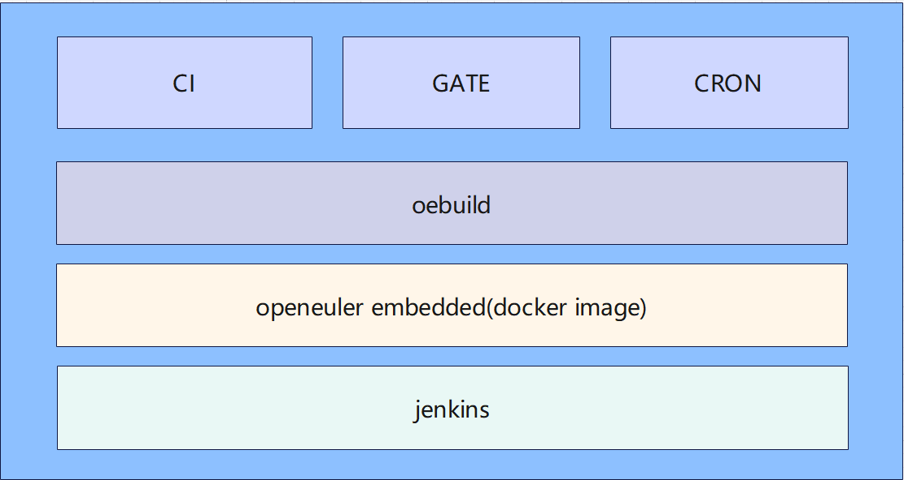

openEuler Embedded基础设施工程采用sstate-cache技术，以及openeuler_fetch的加持，使门禁的运行效率比正常编译提高60%

#### 总体架构介绍

总体架构如下图所示：



openEuler Embedded 基础设施总体由三个模块组成：

CRON: 定时任务模块，该模块通过设置定时时间来定时产生sstate-cache

CI: CI模块，该模块目前依据定时任务，每日进行构建，并将构建产物上传到远程服务器

GATE: 门禁模块，该模块处理来自pull request的提交

三个模块全部通过调用oebuild来运行，工程被jenkins调用，在openeuler embedded 的docker构建容器上运行

目前构建容器


三个模块之间的逻辑图如下


从图中可以看出，CI模块与GATE模块依赖定时模块产生的sstate-cache，CI模块与门禁模块在进行构建时会先拷贝定时模块产生的sstate-cache，然后再开始构建，由于yocto的sstate-cache机制，因此构建效率会极大的提升。因为需要拷贝，因此需要CRON，CI以及GATE有一个共享磁盘，CRON将sstate-cache保存到共享磁盘上，CI与GATE从共享磁盘指定路径进行拷贝。

sstate-cache路径：<共享路径>/

#### 模块介绍

##### CRON模块

该模块作用是定时产生sstate-cache，sstate-cache是bitbake实现的一个共享状态缓存，其通过重用来自缓存的已经处理过的任务输出来极大地加速构建过程。

构建内容通过配置文件来指定，配置文件格式如下：

```
build_list:
  - arch: aarch64
    toolchain: openeuler_gcc_arm64le
    board: 
    - name: qemu 
      platform: aarch64-std
      # feature: 
      # - name: openeuler-rt
      directory: aarch64-qemu
      bitbake:
      - target: openeuler-image
      - target: openeuler-image -c do_populate_sdk
      delete_cache: output|cache|sstate-cache
```

- arch：表示构建架构
- toolchain：表示构建使用的工具链
- board：表示该架构下构建的单板模块
- name：表示单板名称
- platform：单本平台，需要在yocto中支持
- feature：特性，需要在openeuler-meta-openeuler/.oebuild/feature中适配
- directory：表示构建目录
- bitbake：表示构建列表
- target：表示构建目标
- delete_cache：表示删除构建目录下的文件或文件夹

CRON在jenkins中通过配置pipline流水线来运行，CRON流水线配置如下：

```
pipeline {
    agent { node "k8s-x86-rtos-openeuler-test" }
    environment {
        PATH = "/home/jenkins/.local/bin:${env.PATH}"
    }
    stages {
        stage('clone openeuler-ci') {
            steps {
                dir('/home/jenkins/agent'){
                    script {
                        if(fileExists('openeuler-ci') == false) {
                            sh 'git clone https://gitee.com/alichinese/openeuler-ci.git -v /home/jenkins/agent/openeuler-ci --depth=1'
                        }
                    }
                }
            }
        }
        stage('run cron') {
            steps {
                dir('/home/jenkins/agent/openeuler-ci'){
                    script{
                        if(fileExists('/home/jenkins/ccache/openeuler_embedded/gate/openeuler_master') == false) {
                            sh 'mkdir -p /home/jenkins/ccache/openeuler_embedded/gate/openeuler_master'
                        }
                        sh """
                        python3 main.py cron -s /home/jenkins/ccache/openeuler_embedded
                        """
                    }
                }
            }
        }
    }
}
```

##### CI模块

该模块主要实现每日定时构建，并将构建产物上传到远程服务器，同时将构建失败产物以issue方式发送到yocto-meta-openeuler主构建仓，其在构建过程中会应用sstate-cache，将cron模块中的对应构建目录下的sstate-cache拷贝到当下构建目录中。

构建内容通过配置文件来指定，配置文件格式如下：

```
build_list:
  - arch: aarch64
    toolchain: openeuler_gcc_arm64le
    board: 
    - name: qemu 
      platform: aarch64-std
      directory: aarch64-qemu
      # feature: 
      # - name: openeuler-rt
      bitbake:
      - target: openeuler-image
      - target: openeuler-image -c do_populate_sdk
```

总体配置解读参考cron配置解读


CI流程图如下：


CI在jenkins中通过配置pipline流水线来运行， jenkins流水线配置：

```
pipeline {
    agent { node "k8s-x86-rtos-openeuler-test" }
    environment {
        PATH = "/home/jenkins/.local/bin:${env.PATH}"
    }
    stages {
        stage('clone openeuler-ci') {
            steps {
                dir('/home/jenkins/agent'){
                    script {
                        if(fileExists('openeuler-ci') == false) {
                            sh 'git clone https://gitee.com/alichinese/openeuler-ci.git -v /home/jenkins/agent/openeuler-ci --depth=1'
                        }
                    }
                }
            }
        }
        stage('run ci') {
            steps {
                dir('/home/jenkins/agent/openeuler-ci'){
                    script{
                        if(fileExists('/home/jenkins/ccache/openeuler_embedded/gate/openeuler_master') == false) {
                            sh 'mkdir -p /home/jenkins/ccache/openeuler_embedded/gate/openeuler_master'
                        }
                        withCredentials([
                            file(credentialsId: 'xxx', variable: 'PUBLISH_KEY'),
                            string(credentialsId: 'xxxt', variable: 'GITEETOKEN')]) {
                            sh """python3 main.py ci \
                            -s /home/jenkins/ccache/openeuler_embedded \
                            -e /repo/openeuler/dailybuild/openEuler-Mainline/openEuler-Mainline/embedded_img \
                            -i "xxx" \
                            -u root \
                            -k $PUBLISH_KEY \
                            -dm \
                            -o openeuler \
                            -p yocto-meta-openeuler \
                            -gt $GITEETOKEN \
                            -sf
                            """
                        }
                    }
                }
            }
        }
    }
}
```

##### GATE模块

该模块主要实现在开发者提交pull request后进行对提交内容的检查，并将检查结果发送到提交评论区，其在构建过程中会应用sstate-cache，将cron模块中的对应构建目录下的sstate-cache拷贝到当下构建目录中。

GATE jenkins流水线配置

```
pipeline {
    agent { node "k8s-x86-rtos-openeuler-test" }
    environment {
        PATH = "/home/jenkins/.local/bin:${env.PATH}"
    }
    stages {
        stage('clone openeuler-ci') {
            steps {
                dir('/home/jenkins/agent'){
                    script {
                        if(fileExists('openeuler-ci') == false) {
                            sh 'git clone https://gitee.com/alichinese/openeuler-ci.git -v /home/jenkins/agent/openeuler-ci --depth=1'
                        }
                    }
                }
            }
        }
        stage('run gate') {
            steps {
                dir('/home/jenkins/agent/openeuler-ci'){
                    script{
                        withCredentials([
                            string(credentialsId: 'xxx', variable: 'GITEETOKEN'),
                            usernamePassword(credentialsId: 'xxx', usernameVariable: 'JUSER',passwordVariable: 'JPASSWD')]){
                            sh """
                            python3 main.py gate \
                            -s /home/jenkins/ccache/openeuler_embedded \
                            -pr $giteePullRequestid \
                            -o $giteeTargetNamespace \
                            -p $giteeRepoName \
                            -b $giteeTargetBranch \
                            -gt $GITEETOKEN \
                            -juser $JUSER \
                            -jpwd $JPASSWD \
                            -dm
                            """
                        }
                    }
                }
            }
        }
    }
}
```

参数解读：

$giteePullRequestid：pull_request.number

$giteeTargetNamespace：pull_request.base.repo.namespace

$giteeRepoName：repository.name

$giteeTargetBranch：pull_request.base.ref

以上参数在`Generic Webhook Trigger下`的`Post content parameters `添加相应的映射变量即可
