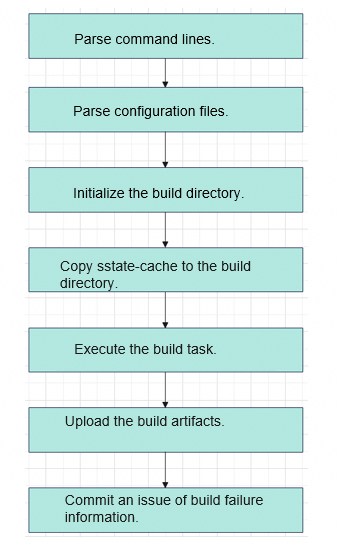
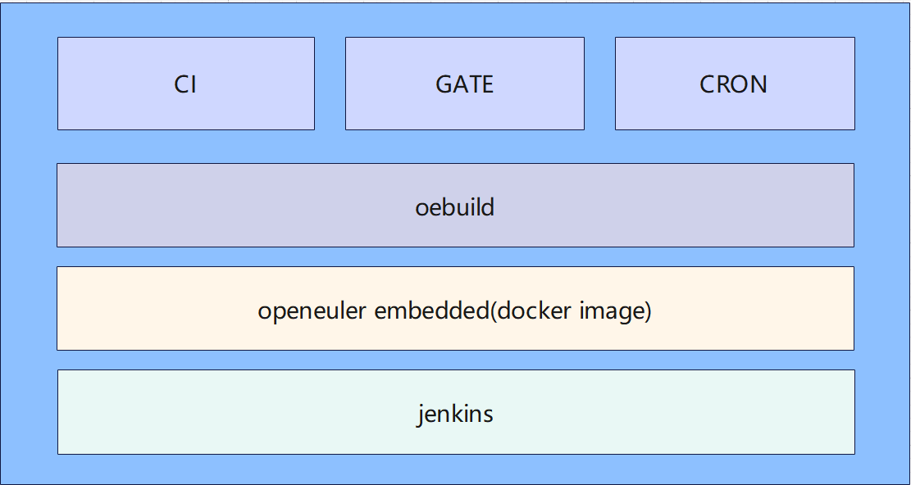
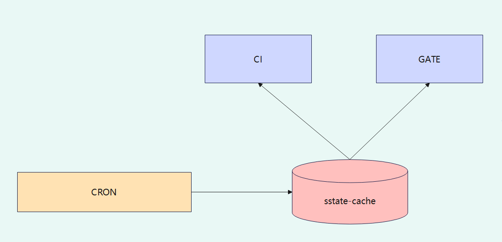

# Overview

The openEuler Embedded infrastructure engineering leverages `sstate-cache` technology alongside `openeuler_fetch` acceleration, reducing the PR gating build time by 60% compared to a standard full compilation.

The overall architecture is illustrated below.



The openEuler Embedded infrastructure consists of three core modules:

CRON: Scheduled task module. It generates `sstate-cache` at preconfigured intervals.

CI: Continuous integration module. Guided by scheduled tasks, this module executes nightly builds and uploads the build artifacts to a remote server.

GATE: PR gating module. It validates pull request submissions from developers.

All three modules interact with the infrastructure by invoking oebuild. The pipeline workflows are orchestrated by Jenkins and run within the openEuler Embedded Docker.

The logical workflow and relationships among the three modules are shown below:



As shown in the diagram, both the CI and GATE modules depend on the `sstate-cache` generated by the CRON module. Before initiating a compilation, the CI and GATE tasks copy the latest `sstate-cache` from the CRON module's output directory. Powered by Yocto's `sstate-cache` reuse mechanism, this workflow significantly enhances overall build efficiency. To support this caching mechanism, the CRON, CI, and GATE modules must share access to a single path. The CRON module saves the generated `sstate-cache` artifacts to this path, and the CI and GATE modules copy them from the specified path before executing their builds.

`sstate-cache` path: <*Shared_path*>/

## Module Introduction

### CRON

The primary purpose of this module is to generate `sstate-cache` artifacts on a scheduled basis. The `sstate-cache` (shared state cache) is a BitBake mechanism that significantly accelerates builds by reusing the outputs of previously processed tasks from the cache directory.

The build configurations are defined in a YAML configuration file as follows:

```sh
build_list:
  - arch: aarch64
    toolchain: openeuler_gcc_arm64le
    board: 
    - name: qemu 
      platform: aarch64-std
      # feature: 
      # - name: openeuler-rt
      directory: aarch64-qemu
      bitbake:
      - target: openeuler-image
      - target: openeuler-image -c do_populate_sdk
      delete_cache: output|cache|sstate-cache
```

- `arch`: Target build architecture.
- `toolchain`: Toolchain used for build.
- `board`: Target board for the specified architecture.
- `name`: Board name.
- `platform`: Target board platform, which must be supported in the Yocto layers.
- `feature`: Feature, which must be adapted in `openeuler-meta-openeuler/.oebuild/feature`.
- `directory`: Build directory.
- `bitbake`: Build list.
- `target`: Build target.
- `delete_cache`: Files or folders to be cleared in the build directory.

The CRON module is orchestrated via a Jenkins pipeline. The Jenkinsfile configuration is shown below:

```sh
pipeline {
    agent { node "k8s-x86-rtos-openeuler-test" }
    environment {
        PATH = "/home/jenkins/.local/bin:${env.PATH}"
    }
    stages {
        stage('clone openeuler-ci') {
            steps {
                dir('/home/jenkins/agent'){
                    script {
                        if(fileExists('openeuler-ci') == false) {
                            sh 'git clone https://gitee.com/alichinese/openeuler-ci.git -v /home/jenkins/agent/openeuler-ci --depth=1'
                        }
                    }
                }
            }
        }
        stage('run cron') {
            steps {
                dir('/home/jenkins/agent/openeuler-ci'){
                    script{
                        if(fileExists('/home/jenkins/ccache/openeuler_embedded/gate/openeuler_master') == false) {
                            sh 'mkdir -p /home/jenkins/ccache/openeuler_embedded/gate/openeuler_master'
                        }
                        sh """
                        python3 main.py cron -s /home/jenkins/ccache/openeuler_embedded
                        """
                    }
                }
            }
        }
    }
}
```

### CI Module

The CI module orchestrates the daily builds, uploads successful build artifacts to a remote server, and automatically submits issue reports to the core compilation repository (`yocto-meta-openeuler`) if a build fails. During execution, it leverages the `sstate-cache` mechanism by copying the cached build outputs from the corresponding CRON directory to its current working directory.

The CI build targets are defined via the following configuration file:

```sh
build_list:
  - arch: aarch64
    toolchain: openeuler_gcc_arm64le
    board: 
    - name: qemu 
      platform: aarch64-std
      directory: aarch64-qemu
      # feature: 
      # - name: openeuler-rt
      bitbake:
      - target: openeuler-image
      - target: openeuler-image -c do_populate_sdk
```

For parameter descriptions, see the CRON configuration breakdown above.

The CI process workflow is illustrated below:



The CI module is orchestrated via a Jenkins pipeline. The Jenkinsfile configuration is shown below:

```sh
pipeline {
    agent { node "k8s-x86-rtos-openeuler-test" }
    environment {
        PATH = "/home/jenkins/.local/bin:${env.PATH}"
    }
    stages {
        stage('clone openeuler-ci') {
            steps {
                dir('/home/jenkins/agent'){
                    script {
                        if(fileExists('openeuler-ci') == false) {
                            sh 'git clone https://gitee.com/alichinese/openeuler-ci.git -v /home/jenkins/agent/openeuler-ci --depth=1'
                        }
                    }
                }
            }
        }
        stage('run ci') {
            steps {
                dir('/home/jenkins/agent/openeuler-ci'){
                    script{
                        if(fileExists('/home/jenkins/ccache/openeuler_embedded/gate/openeuler_master') == false) {
                            sh 'mkdir -p /home/jenkins/ccache/openeuler_embedded/gate/openeuler_master'
                        }
                        withCredentials([
                            file(credentialsId: 'xxx', variable: 'PUBLISH_KEY'),
                            string(credentialsId: 'xxxt', variable: 'GITEETOKEN')]) {
                            sh """python3 main.py ci \
                            -s /home/jenkins/ccache/openeuler_embedded \
                            -e /repo/openeuler/dailybuild/openEuler-Mainline/openEuler-Mainline/embedded_img \
                            -i "xxx" \
                            -u root \
                            -k $PUBLISH_KEY \
                            -dm \
                            -o openeuler \
                            -p yocto-meta-openeuler \
                            -gt $GITEETOKEN \
                            -sf
                            """
                        }
                    }
                }
            }
        }
    }
}
```

### GATE Module

The GATE module validates code changes whenever a developer submits a pull request. Once validation is complete, it posts the test results back to the pull request's comment section. Similar to the CI module, GATE optimizes build speeds by copying the matching `sstate-cache` from the CRON module's output path into its active build directory before compilation.

GATE module Jenkins pipeline configuration:

```sh
pipeline {
    agent { node "k8s-x86-rtos-openeuler-test" }
    environment {
        PATH = "/home/jenkins/.local/bin:${env.PATH}"
    }
    stages {
        stage('clone openeuler-ci') {
            steps {
                dir('/home/jenkins/agent'){
                    script {
                        if(fileExists('openeuler-ci') == false) {
                            sh 'git clone https://gitee.com/alichinese/openeuler-ci.git -v /home/jenkins/agent/openeuler-ci --depth=1'
                        }
                    }
                }
            }
        }
        stage('run gate') {
            steps {
                dir('/home/jenkins/agent/openeuler-ci'){
                    script{
                        withCredentials([
                            string(credentialsId: 'xxx', variable: 'GITEETOKEN'),
                            usernamePassword(credentialsId: 'xxx', usernameVariable: 'JUSER',passwordVariable: 'JPASSWD')]){
                            sh """
                            python3 main.py gate \
                            -s /home/jenkins/ccache/openeuler_embedded \
                            -pr $giteePullRequestid \
                            -o $giteeTargetNamespace \
                            -p $giteeRepoName \
                            -b $giteeTargetBranch \
                            -gt $GITEETOKEN \
                            -juser $JUSER \
                            -jpwd $JPASSWD \
                            -dm
                            """
                        }
                    }
                }
            }
        }
    }
}
```

Parameters:

`$giteePullRequestid` maps to `pull_request.number`

`$giteeTargetNamespace` maps to `pull_request.base.repo.namespace`

`$giteeRepoName` maps to `repository.name`

`$giteeTargetBranch` maps to `pull_request.base.ref`

Configure the corresponding variable mappings in `Post content parameters` under `Generic Webhook Trigger`.
